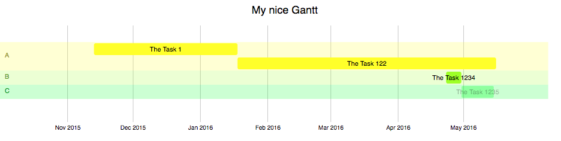

Very simple offline gantt diagram for simple project planning.

Original Source: A Pen created at CodePen.io. You can find this one at <https://codepen.io/jdefreites/pen/paLHc>

I made many modifications so that it worked for my projects.
You basically just need to modify js/gantt_variables.js to use your content.

